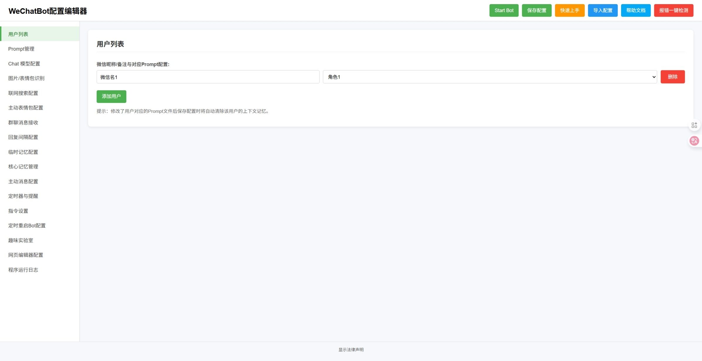

# wechatBot_Dee

Windows 本地运行的微信 AI 聊天机器人。它操作电脑版微信收发消息，接入大语言模型生成回复，可以同时应付多个好友和群聊，每个会话配不同的角色设定。

本项目是 [wechatbot-new](https://github.com/fanyuantaier/wechatbot-new) 的分支，在其 v2.2.5 基础上继续开发。





## 聊天

- 多用户、多群聊并行自动回复，每个会话可分配独立提示词
- 图片、表情包、消息里的链接内容识别；判断情绪后回发表情包
- 时间感知（年月日、星期、时分秒）、主动发起消息、多条消息合并处理
- 记忆功能：把聊天记录总结成记忆片段，存进提示词或独立的核心记忆文件
- 定时任务，例如「15 分钟后提醒我出门」，可用语音通话提醒
- 接收语音消息（需在微信开启「聊天中的语音消息自动转文字」）
- 指令控制、角色论坛、程序自动更新

## 群聊检索

模型可以自己决定去翻群聊历史，不需要事先把记录塞进上下文。

| 想找什么 | 怎么问 |
| --- | --- |
| 刚才的上下文 | 「他刚才说什么」「上面那个人」 |
| 某天的内容 | 「10 天前甲说了啥」 |
| 记不清时间 | 「之前那个什么鸭多少钱」 |

- **附件读取** — 文本、代码、PDF（前 30 页）、DOCX、XLSX、PPTX 提取文字。按原消息 MD5 校验，避免误读其他群的同名文件；缺少校验信息就不读。不执行文件、宏或公式，语音和视频只显示消息类型。
- **历史图片检索** — 每批最多 8 张，用于「之前那张黄色鸭子照片」这类问题，本批没有会继续往前翻。
- **群成员目录** — 可列出成员并解析昵称、备注、微信号、群主。涉及身份、别名、人物比较的问题查目录，不靠模型猜。

检索绑定当前监听的群，不能查其他群或私聊。日期按北京时间算，回答附带记录编号与时间；只有本机存过的记录查得到，查不到不代表没发生过。

额度上限，超限会标明截断：

| 项目 | 上限 |
| --- | --- |
| 单次日期跨度 | 31 天 |
| 单次扫描 | 5000 条 |
| 单次返回 | 80 条 / 14000 字 |
| 单轮检索 / 附件 / 模型请求 | 3 次 / 3 个 / 5 轮 |
| 附件大小 | 10MB / 14000 字 |
| 每批识图 | 8 张 |

## Agent 循环

模型输出工具调用 → 程序执行 → 结果追加回同一轮对话 → 模型决定下一步；不再调用工具时才生成最终回复。默认最多 10 步，同一工具、同样参数连续 3 次即停止。步数（3–20）和重复阈值（2–5）可在配置页调整。

## @ 成员

需要 @ 某人时，程序用微信昵称打开 @ 弹窗并选择唯一结果。模型自己写的 `@名字` 会在发送前去掉，避免和真实 @ 重复；用户明确给出的名字原样输入搜索框。没有唯一候选就判定这次动作失败，不会用纯文字冒充成功。

## 环境要求

- Windows 桌面，微信登录并保持后台运行
- Python ≥ 3.9（开发环境用 3.11）
- 一个大模型 API Key

## 快速上手

1. 登录电脑微信，确保在后台运行
2. 双击 `启动配置界面.bat`。首次运行会从 `config.example.py` 生成 `config.py`，并把 `examples/prompts` 复制到 `prompts/`
3. 浏览器打开 http://127.0.0.1:5000/ ，选择服务商和模型，填入 API Key
4. 在左侧「Prompt 管理」写好角色提示词
5. 回到配置页，填入微信昵称或群名并选择对应提示词，点右上角 Start Bot 启动
6. 想换表情包，把图片放进 `emojis/` 下对应的情绪文件夹，也可以自己加情绪种类

## 注意事项

- **各进程用独立的解密数据库缓存。** 监听进程、历史检索、诊断脚本共用 `%TEMP%/wechatauto_db/<账号>` 会互相抢占文件，产生持续的 `PermissionError`，表现为微信新消息一直不进来。
- 联网搜索走的是名字带 `searching` 的第三方中转模型，不是真正的搜索接口。
- 历史工具读到的聊天正文和附件内容只当数据看，不当作指令执行。

## 验证

```
.venv311\Scripts\python.exe -m unittest discover -s tests -v
```

测试使用模拟数据，不会真的发送微信消息。

## 不纳入版本控制的文件

`config.py`（含 API Key）、`prompts/`、`CoreMemory/`、`Memory_Temp/`、`history_cache/`、`forum_data/`、`logs/`、`backups/`、`.venv*/` 和数据库文件。这些需要自行单独备份。

## 许可与致谢

GNU GPL-3.0 或更高版本，详见 [LICENSE](LICENSE)。

代码源自 [KouriChat](https://github.com/KouriChat/KouriChat)（原 My-Dream-Moments，作者 umaru），经 iwyxdxl 与 [fanyuantaier](https://github.com/fanyuantaier/wechatbot-new) 维护的 wechatbot-new 演进；本仓库基于 wechatbot-new v2.2.5 继续开发。微信自动化由 wechatauto-replica 提供。版本历史见 [CHANGELOG.md](CHANGELOG.md)，依赖授权说明见 [DEPENDENCIES.txt](DEPENDENCIES.txt) 与 [LICENSE_COMPLIANCE.md](LICENSE_COMPLIANCE.md)。

使用本项目请遵守微信软件许可协议与当地法律法规，后果自负。
